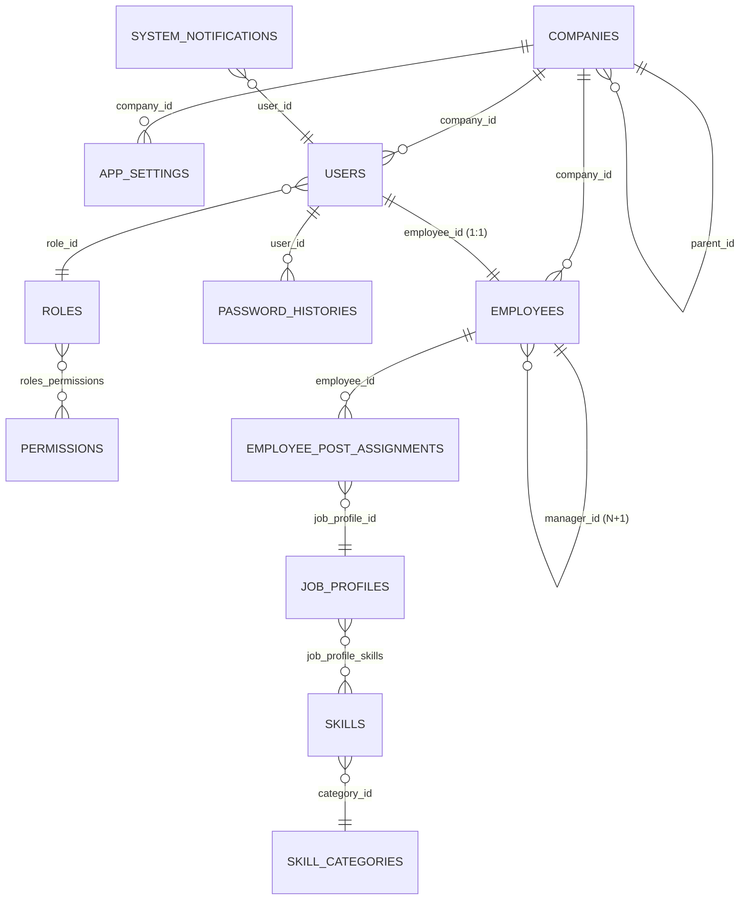

# Architecture de la Base de Données - Talentflow

Ce document présente l'architecture actuelle de la base de données relationnelle de **Talentflow** implémentée sous PostgreSQL. Il détaille la structure des tables, leurs relations (modélisées par les entités JPA), les types de données et les clés.

---

## 📊 Diagramme Entité-Association (MCD)

Voici la cartographie visuelle actuelle des relations entre les tables de Talentflow au format **Mermaid**.

---

## 🗄️ Dictionnaire des Tables

### 1. Table `companies` (Sociétés & Filiales)
Gère l'organisation composite multi-sociétés sous forme arborescente.

| Colonne | Type PostgreSQL | JPA Mapping | Description / Contrainte |
| :--- | :--- | :--- | :--- |
| `id` | `BIGINT` | `@Id @GeneratedValue` | Clé primaire unique. |
| `name` | `VARCHAR(255)` | `@Column(nullable = false)` | Nom de la société / filiale. |
| `vat_number` | `VARCHAR(255)` | `@Column(name = "vat_number")` | Numéro de TVA ou SIRET. |
| `address` | `VARCHAR(255)` | `private String address` | Adresse physique. |
| `city` | `VARCHAR(255)` | `private String city` | Ville. |
| `postal_code` | `VARCHAR(255)` | `@Column(name = "postal_code")` | Code postal. |
| `country` | `VARCHAR(255)` | `private String country` | Pays. |
| `contact_info` | `VARCHAR(255)` | `@Column(name = "contact_info")` | Adresse e-mail ou téléphone de contact. |
| `parent_id` | `BIGINT` | `@ManyToOne (FK)` | Référence à la société parente (relation arborescente). |
| `logo` | `TEXT` | `@Column(columnDefinition = "TEXT")` | Logo de l'entreprise au format Base64. |

---

### 2. Table `employees` (Registre des Collaborateurs)
Fiche d'identité RH unique d'un collaborateur dans le système.

| Colonne | Type PostgreSQL | JPA Mapping | Description / Contrainte |
| :--- | :--- | :--- | :--- |
| `id` | `BIGINT` | `@Id @GeneratedValue` | Clé primaire. |
| `first_name` | `VARCHAR(255)` | `@Column(name = "first_name", nullable = false)` | Prénom. |
| `last_name` | `VARCHAR(255)` | `@Column(name = "last_name", nullable = false)` | Nom de famille. |
| `email` | `VARCHAR(255)` | `@Column(nullable = false, unique = true)` | E-mail professionnel unique. |
| `phone_number` | `VARCHAR(255)` | `@Column(name = "phone_number")` | Numéro de téléphone professionnel. |
| `birth_date` | `DATE` | `@Column(name = "birth_date")` | Date de naissance (calcul d'âge). |
| `gender` | `VARCHAR(255)` | `private String gender` | Genre issu de `GENDER_LIST`. |
| `department` | `VARCHAR(255)` | `private String department` | Service ou département d'affectation. |
| `company_id` | `BIGINT` | `@ManyToOne (FK)` | Société d'appartenance. |
| `manager_id` | `BIGINT` | `@ManyToOne (FK)` | Responsable Hiérarchique N+1 (relation réflexive). |
| `entry_date` | `DATE` | `@Column(name = "entry_date")` | Date d'entrée dans la société. |
| `retirement_date` | `DATE` | `@Column(name = "retirement_date")` | Date de départ en retraite prévisionnel. |
| `job_title` | `VARCHAR(255)` | `@Column(name = "job_title")` | Intitulé de poste actuel (cache). |
| `key_skill` | `VARCHAR(255)` | `@Column(name = "key_skill")` | Compétence clé principale. |
| `skill_level` | `INT` | `@Column(name = "skill_level", nullable = false)` | Niveau de compétence (1 à 5). |
| `habilitation_name` | `VARCHAR(255)` | `@Column(name = "habilitation_name")` | Nom de l'habilitation critique détenue. |
| `habilitation_expiry` | `DATE` | `@Column(name = "habilitation_expiry_date")` | Date d'échéance de l'habilitation. |
| `active` | `BOOLEAN` | `@Column(nullable = false)` | Statut d'activation RH (Soft delete si désactivé). |

---

### 3. Table `employee_post_assignments` (Historique des Affectations)
Table de liaison temporelle permettant l'historisation des postes et la gestion multi-postes simultanés.

| Colonne | Type PostgreSQL | JPA Mapping | Description / Contrainte |
| :--- | :--- | :--- | :--- |
| `id` | `BIGINT` | `@Id @GeneratedValue` | Clé primaire. |
| `employee_id` | `BIGINT` | `@ManyToOne (FK, nullable = false)` | Collaborateur concerné. |
| `job_profile_id` | `BIGINT` | `@ManyToOne (FK, nullable = false)` | Profil de poste affecté. |
| `start_date` | `DATE` | `@Column(name = "start_date", nullable = false)` | Date de début de l'affectation. |
| `end_date` | `DATE` | `@Column(name = "end_date")` | Date de fin d'affectation (vide si poste actif). |
| `active` | `BOOLEAN` | `@Column(nullable = false)` | Indique si le poste est actuellement occupé de façon active. |

---

### 4. Table `users` (Comptes Utilisateurs)
Gère les identifiants d'accès, la sécurité et la traçabilité des connexions.

| Colonne | Type PostgreSQL | JPA Mapping | Description / Contrainte |
| :--- | :--- | :--- | :--- |
| `id` | `BIGINT` | `@Id @GeneratedValue` | Clé primaire. |
| `username` | `VARCHAR(255)` | `@Column(nullable = false, unique = true)` | Identifiant de connexion unique. |
| `password` | `VARCHAR(255)` | `private String password` | Mot de passe crypté via BCrypt. |
| `email` | `VARCHAR(255)` | `@Column(nullable = false, unique = true)` | E-mail utilisateur unique. |
| `company_id` | `BIGINT` | `@ManyToOne (FK)` | Société active de l'utilisateur. |
| `role_id` | `BIGINT` | `@ManyToOne (FK)` | Rôle d'accès système attribué. |
| `employee_id` | `BIGINT` | `@OneToOne (FK, nullable = true)` | Fiche RH liée au compte (liaison 1:1 optionnelle). |
| `active` | `BOOLEAN` | `@Column(nullable = false)` | Compte actif / inactif. |
| `first_name` | `VARCHAR(255)` | `@Column(name = "first_name")` | Prénom utilisateur (contrôle de mot de passe). |
| `last_name` | `VARCHAR(255)` | `@Column(name = "last_name")` | Nom de famille (contrôle de mot de passe). |
| `first_login` | `BOOLEAN` | `@Column(name = "first_login", nullable = false)` | Vrai si première connexion (force le changement). |
| `password_last_changed` | `TIMESTAMP` | `@Column(name = "password_last_changed")` | Date et heure de dernière modification. |
| `reset_token` | `VARCHAR(255)` | `@Column(name = "reset_token")` | Jeton de réinitialisation de mot de passe. |
| `token_expiry` | `TIMESTAMP` | `@Column(name = "token_expiry")` | Date d'expiration du jeton de réinitialisation. |
| `failed_login_attempts` | `INT` | `@Column(name = "failed_login_attempts", nullable = false)` | Tentatives de connexion incorrectes successives. |
| `locked_until` | `TIMESTAMP` | `@Column(name = "locked_until")` | Date et heure de déblocage automatique (5 minutes). |
| `account_disabled` | `BOOLEAN` | `@Column(name = "account_disabled", nullable = false)` | Bloqué définitivement (exige un admin). |

---

### 5. Table `password_histories` (Historique des Mots de Passe)
Empêche la réutilisation des anciens mots de passe d'un utilisateur.

| Colonne | Type PostgreSQL | JPA Mapping | Description / Contrainte |
| :--- | :--- | :--- | :--- |
| `id` | `BIGINT` | `@Id @GeneratedValue` | Clé primaire. |
| `user_id` | `BIGINT` | `@ManyToOne (FK, nullable = false)` | Utilisateur concerné. |
| `password_hash` | `VARCHAR(255)` | `@Column(name = "password_hash", nullable = false)` | Empreinte cryptée du mot de passe utilisé. |
| `changed_at` | `TIMESTAMP` | `@Column(name = "changed_at", nullable = false)` | Date et heure d'enregistrement de ce mot de passe. |

---

### 6. Table `roles` (Rôles d'Accès Système)
Définit les profils d'accès des utilisateurs de la plateforme.

| Colonne | Type PostgreSQL | JPA Mapping | Description / Contrainte |
| :--- | :--- | :--- | :--- |
| `id` | `BIGINT` | `@Id @GeneratedValue` | Clé primaire. |
| `name` | `VARCHAR(255)` | `@Column(nullable = false, unique = true)` | Nom unique du rôle (ex: "Administrateur", "RH"). |
| `description` | `VARCHAR(255)` | `private String description` | Description fonctionnelle. |

---

### 7. Table `permissions` (Droits Individuels)
Définit les droits atomiques au sein de la plateforme.

| Colonne | Type PostgreSQL | JPA Mapping | Description / Contrainte |
| :--- | :--- | :--- | :--- |
| `id` | `BIGINT` | `@Id @GeneratedValue` | Clé primaire. |
| `name` | `VARCHAR(255)` | `@Column(nullable = false, unique = true)` | Code unique (ex: "READ_EMPLOYEES"). |
| `description` | `VARCHAR(255)` | `private String description` | Explication du droit. |

---

### 8. Table de liaison `roles_permissions` (Matrice des Droits)
Associe les rôles système à leurs autorisations.

| Colonne | Type PostgreSQL | Description / Contrainte |
| :--- | :--- | :--- |
| `role_id` | `BIGINT (FK)` | Rôle système. |
| `permission_id` | `BIGINT (FK)` | Permission unitaire. |

---

### 9. Table `app_settings` (Configuration Dynamique)
Stocke les paramètres paramétrables de chaque filiale pour éliminer tout hardcoding.

| Colonne | Type PostgreSQL | JPA Mapping | Description / Contrainte |
| :--- | :--- | :--- | :--- |
| `id` | `BIGINT` | `@Id @GeneratedValue` | Clé primaire. |
| `setting_key` | `VARCHAR(255)` | `@Column(name = "setting_key", nullable = false)` | Clé unique (ex: `GENDER_LIST`). |
| `setting_value` | `VARCHAR(255)` | `@Column(name = "setting_value", nullable = false)` | Valeur de configuration (ex: `Homme,Femme,Autre`). |
| `description` | `VARCHAR(255)` | `private String description` | Explication du paramètre. |
| `company_id` | `BIGINT` | `@ManyToOne (FK)` | Société liée (chaque filiale a ses propres règles). |

---

### 10. Table `job_profiles` (Référentiel des Postes Métiers)
Fiches de postes métiers standardisées de l'organisation.

| Colonne | Type PostgreSQL | JPA Mapping | Description / Contrainte |
| :--- | :--- | :--- | :--- |
| `id` | `BIGINT` | `@Id @GeneratedValue` | Clé primaire. |
| `name` | `VARCHAR(255)` | `@Column(nullable = false)` | Nom du poste (ex: "Responsable RH"). |
| `description` | `TEXT` | `@Column(columnDefinition = "TEXT")` | Description ou fiche de poste détaillée. |
| `responsibility_level` | `INT` | `@Column(name = "responsibility_level")` | Niveau hiérarchique (de 1 à 10). |
| `active` | `BOOLEAN` | `private boolean active = true` | Poste actif / inactif. |
| `company_id` | `BIGINT` | `@ManyToOne (FK)` | Société de rattachement. |

---

### 11. Table `skills` (Dictionnaire des Compétences)
Dictionnaire des compétences requises au sein de l'organisation.

| Colonne | Type PostgreSQL | JPA Mapping | Description / Contrainte |
| :--- | :--- | :--- | :--- |
| `id` | `BIGINT` | `@Id @GeneratedValue` | Clé primaire. |
| `name` | `VARCHAR(255)` | `@Column(nullable = false)` | Libellé (ex: "Java & Angular"). |
| `description` | `TEXT` | `@Column(columnDefinition = "TEXT")` | Explication de la compétence. |
| `category_id` | `BIGINT` | `@ManyToOne (FK)` | Catégorie parente. |
| `company_id` | `BIGINT` | `@ManyToOne (FK)` | Société de rattachement. |
| `criticality` | `VARCHAR(50)` | `@Enumerated(EnumType.STRING)` | Niveau de criticité (FAIBLE, MOYEN, CRITIQUE). |
| `min_required_level` | `INT` | `@Column(name = "min_required_level")` | Niveau minimal d'expertise. |
| `expected_level` | `INT` | `@Column(name = "expected_level")` | Niveau d'expertise cible attendu. |
| `mandatory_by_default` | `BOOLEAN` | `@Column(name = "mandatory_by_default")` | Obligatoire par défaut pour les postes. |
| `active` | `BOOLEAN` | `private boolean active = true` | Compétence active / inactive. |

---

### 12. Table `skill_categories` (Catégories de Compétences)
Classification thématique pour organiser le dictionnaire.

| Colonne | Type PostgreSQL | JPA Mapping | Description / Contrainte |
| :--- | :--- | :--- | :--- |
| `id` | `BIGINT` | `@Id @GeneratedValue` | Clé primaire. |
| `name` | `VARCHAR(255)` | `@Column(nullable = false)` | Nom de la catégorie (ex: "Technologies"). |
| `description` | `VARCHAR(255)` | `private String description` | Description. |
| `sort_order` | `INT` | `@Column(name = "sort_order")` | Ordre d'affichage dans la grille. |
| `active` | `BOOLEAN` | `private boolean active = true` | Catégorie active / inactive. |
| `company_id` | `BIGINT` | `@ManyToOne (FK)` | Société d'appartenance. |

---

### 13. Table `job_profile_skills` (Compétences par Poste)
Table d'association unissant les compétences exigées par chaque fiche métier.

| Colonne | Type PostgreSQL | JPA Mapping | Description / Contrainte |
| :--- | :--- | :--- | :--- |
| `id` | `BIGINT` | `@Id @GeneratedValue` | Clé primaire. |
| `job_profile_id` | `BIGINT` | `@ManyToOne (FK)` | Profil de poste lié. |
| `skill_id` | `BIGINT` | `@ManyToOne (FK)` | Compétence liée. |
| `expected_level` | `INT` | `@Column(name = "expected_level")` | Niveau requis pour ce poste précis. |
| `mandatory` | `BOOLEAN` | `private boolean mandatory = false` | Vrai si compétence obligatoire pour ce poste. |

---

### 14. Table `email_alert_configs` (Abonnements aux Alertes)
Abonnements aux courriels automatiques (retraites, turn-over).

| Colonne | Type PostgreSQL | JPA Mapping | Description / Contrainte |
| :--- | :--- | :--- | :--- |
| `id` | `BIGINT` | `@Id @GeneratedValue` | Clé primaire. |
| `config_key` | `VARCHAR(255)` | `@Column(name = "config_key", nullable = false)` | Clé système de l'alerte. |
| `name` | `VARCHAR(255)` | `@Column(nullable = false)` | Nom affiché de l'abonnement. |
| `description` | `VARCHAR(255)` | `private String description` | Explication de l'événement. |
| `recipient_role` | `VARCHAR(255)` | `@Column(name = "recipient_role")` | Rôle cible alerté (ex: "Responsable RH"). |
| `active` | `BOOLEAN` | `private boolean active = true` | Actif / Inactif. |

---

### 15. Table `system_notifications` (Notifications de Connexion)
Alertes et messages persistants affichés lors de la connexion de l'utilisateur.

| Colonne | Type PostgreSQL | JPA Mapping | Description / Contrainte |
| :--- | :--- | :--- | :--- |
| `id` | `BIGINT` | `@Id @GeneratedValue` | Clé primaire. |
| `user_id` | `BIGINT` | `@ManyToOne (FK)` | Utilisateur visé (vide si alerte générale). |
| `content` | `VARCHAR(1000)` | `@Column(length = 1000)` | Message de la notification. |
| `created_at` | `TIMESTAMP` | `@Column(name = "created_at")` | Date d'émission du message. |
| `acknowledged` | `BOOLEAN` | `private boolean acknowledged = false` | Indique si le message a été acquitté par l'utilisateur. |
| `repeated` | `BOOLEAN` | `private boolean repeated = false` | Réapparaît à chaque nouvelle session si Vrai. |

---

## 🔄 Mise à jour et Adaptation de l'Architecture
Ce schéma correspond à l'état **actuel** du projet. Il sera enrichi et mis à jour de manière incrémentale à chaque création de nouveaux modules ou tables (par exemple pour les modules de Recrutement, d'Onboarding et de gestion du Télétravail).
